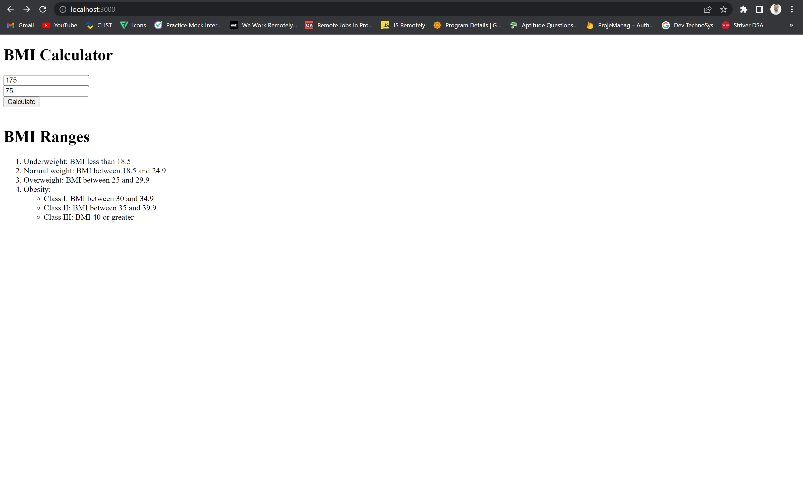
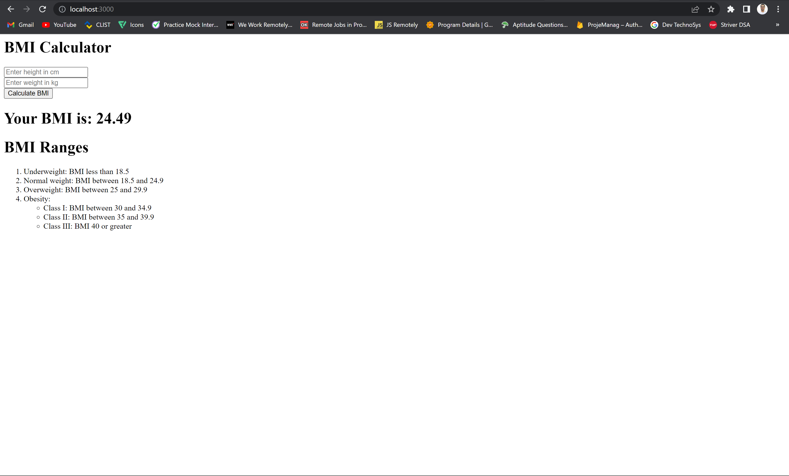

# BMI Calculator

This is a simple BMI (Body Mass Index) calculator web application built with Express.js.

## Screenshots

## Description

The BMI Calculator allows users to calculate their BMI based on their height and weight. It provides an estimate of body fat based on the calculated BMI value.

## Installation

1. Clone the repository:
<code>git clone https://github.com/asadshoyebkhan/BMI-Calculator.git</code>

